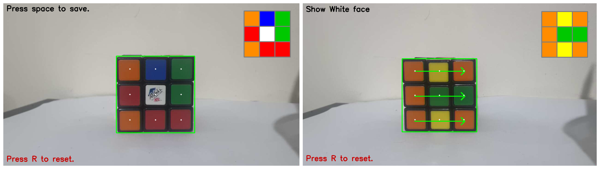

# VisionCube: A Rubik's Cube Solver

VisionCube is a program that helps users solve a Rubik's cube by scanning all sides of the cube and producing a solution algorithm for it.

 

## How it works

The flow involves 4 basic steps:

- Localising the cube face in the frame
- Extracting colors from cube face
- Guiding user to correctly save cube's state
- Run algorithm

### Cube Face Detection

In order to get an accurate boundary as to where the current cube face lies within the frame, I utilised a mix of thresholding and countouring. Thresholding allowed me to isolate the cube from it's surroundings (given its dark edges) which immensely helped with detecting clean contours. And by using contours I was able to get rid of any of thresholding noise. By getting the location of the largest contour detected, I would be sure that it's the one that holds the cube's whole face. Indicated by green bounding box on the UI.

### Color Extraction

Having the cube face's boundary, I knew i could divide it up into 9 equal parts and extract each color. This was challenging as some colors were very similar to eachother in certain lighting so I spent a lot of time finding the right color ranges. And by using masking and HSV color values, I was able to build a robust color extractor that gets all 9 colors on a cube face.

### User Guidance

It is important that the user keeps the orientation of the cube correct so that cube state is saved correctly and thus getting a valid solution. So by following the text prompts and arrow guides, it is very easy for the user to know what the next move is and which side is supposed to be saved.

### Koceimba's Algorithm

I utilised an [external library](https://pypi.org/project/kociemba/) which runs the Kociemba Algorithm for solving Rubik's Cubes given a cube's state. This is what runs after the user scans all 6 sides of the cube. The solution algorithm is then printed out so that the user can perform it and solve the cube.

---

## Constraints and Future improvements

- The cube should be placed in front of a plain, light background so that thresholding and contouring work correctly. This could be mitigated by developing a more complex cube detection solution (ML probably)

- Alternate cube designs that don't have dark edges won't necessarily work given that thresholding would be difficult.

- Extend user guides to guide the user through the solution and not only the state saving step.
